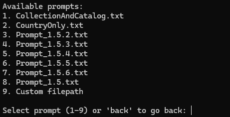

# Prompts

### Prompt 1.5 and 1.5.2:
- This is the base prompt, including all the necessary fields used for transciption. This includes Verbatim Fields along with formatted versions of each one
- Differences in the two are simple preamble instructions before the prompt and some formatting. 

### Prompt 1.5.3, 1.5.4 and 1.5.5:
- These Prompts include a scheme for outputting, including the necessary fields.
- Prompts are written in .md format for clear headers the LLM can read and to emphasize instructions

### Prompt 1.5.6:
- This prompt was an edit of 1.5.2, with Jeff cleaning up a lot of characters and grammar

### Prompt 1.5.7:
- Removed: otherCatalogNumbers, verbatimEventDate
- accessionNumber: do not include barcode numbers
- Other minor edits

## Current Prompt Being used as of : 11/12/2025
### **Prompt 1.5.6**

#

# Adding prompt to the project:
### Windows / linux / Mac
- Navigate to the project folder "Transcriber-CLI-V2" 
- Once inside project folder go to the following path: **Transcriber-CLI-V2\Prompts**
- From here you can add prompts to use. Ensure they are in a .txt format
- Alternatively, you can use a custom prompt when using the cli, choose the custom prompt choice when selecting a prompt, this will be a direct filepath to the .txt file being used. 

